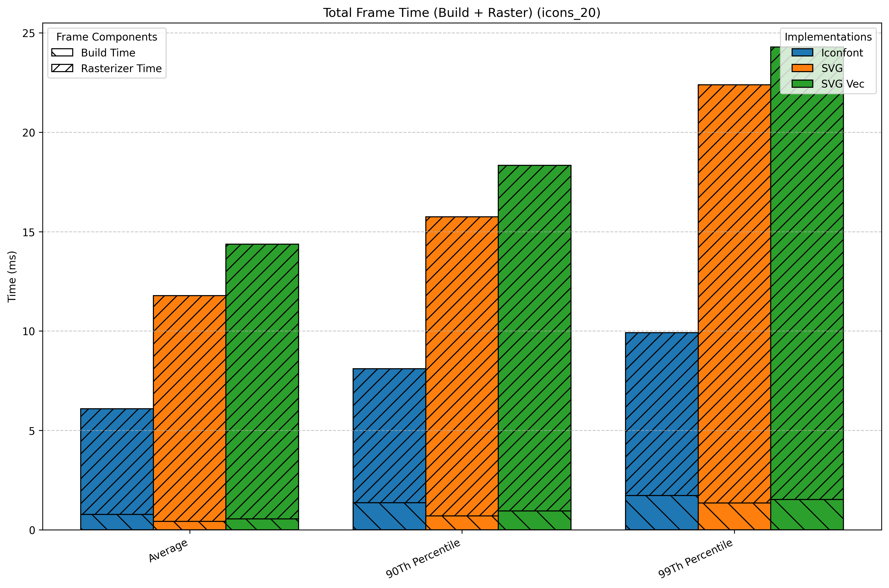
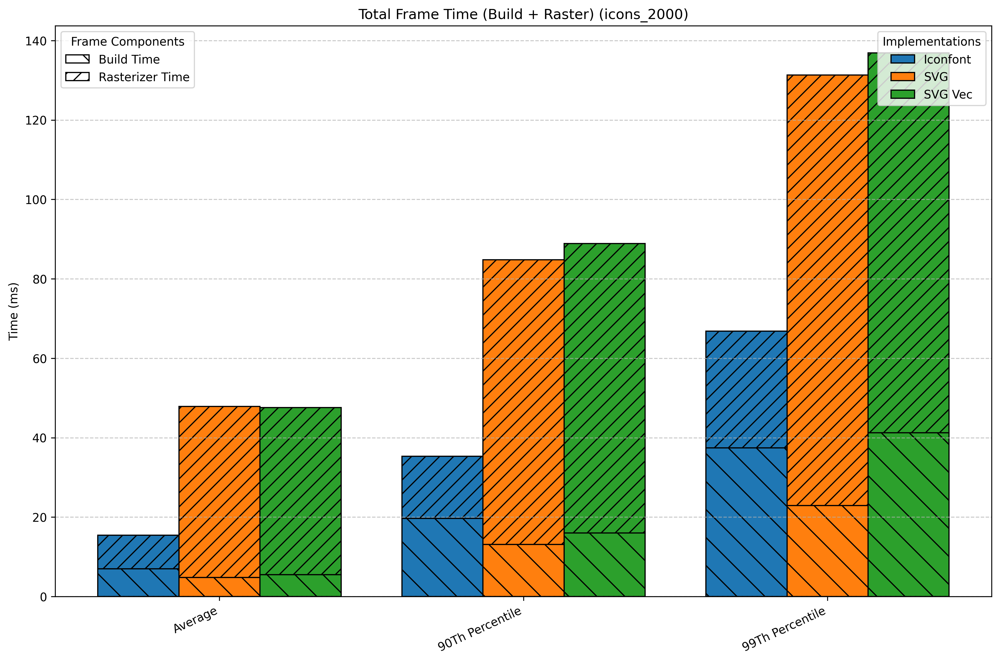

# SVG vs Iconfont

A comparison between SVG and Iconfont performance in Flutter.

To get the reports, use the following command:

```bash
flutter drive \
  --driver=test_driver/perf_driver.dart \
  --target=integration_test/performance_test.dart \
  --profile
```

The results will be saved in the `build` directory. Open `iconfont.timeline_summary.json` and `svg.timeline_summary.json` to compare the performance metrics.

## Results

To view the results I measured on my Macbook M4 Pro, open the `create_report/metrics` folder.




## How this benchmark works

There are 20 and 2000 icons that are displayed in a grid view with X items (25 columns). The icons are repeated to fill the grid. The performance is measured by scrolling the grid view.

- SVG icons are loaded from assets using `flutter_svg` package.
- Iconfont icons are loaded from a custom icon font created by `icon_font_generator` package.

## How to create charts

- Install [uv](https://github.com/astral-sh/uv) package manager`
- cd to the create_report
- Run `uv run main.py`
